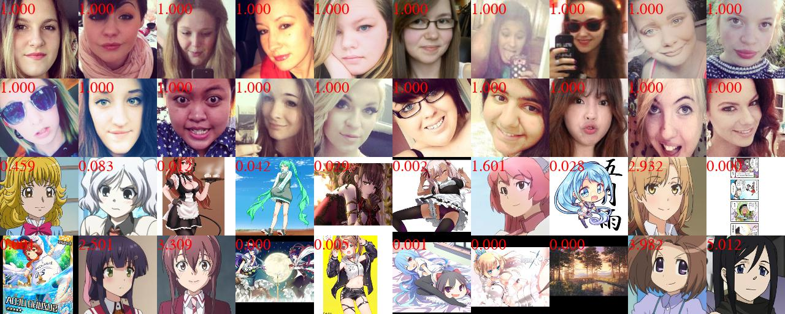
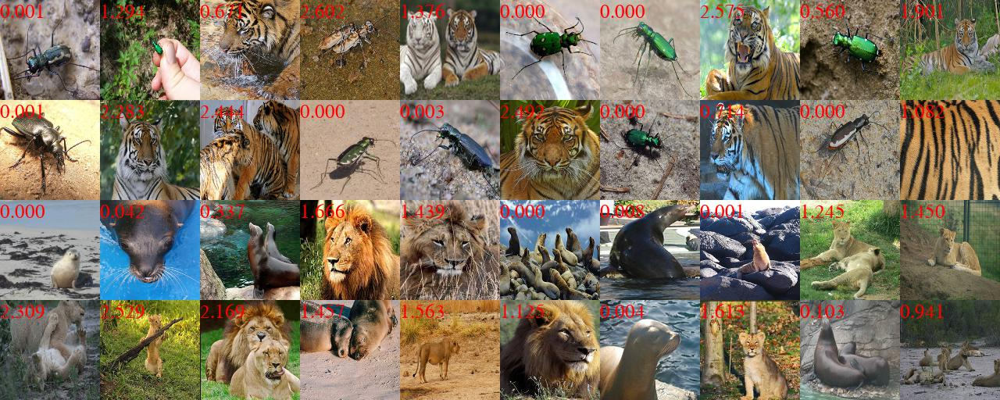

# IrwGAN (ICCV2021) 
## [Unaligned Image-to-Image Translation by Learning to Reweight](https://openaccess.thecvf.com/content/ICCV2021/papers/Xie_Unaligned_Image-to-Image_Translation_by_Learning_to_Reweight_ICCV_2021_paper.pdf)

### [Update] 12/15/2021 All dataset are released, trained models and generated images of IrwGAN are released

### [Update] 11/16/2021 Code is pushed, selfie2anime-danbooru dataset released.


## Dataset

**[selfie2anime-danbooru](https://drive.google.com/file/d/1jWjBygCJo5xrorIRJ8g5TprY69nnQuHY/view?usp=sharing)**
|
**[selfie-horse2zebra-dog](https://drive.google.com/file/d/1e6GmypJfLB-1cNm_GoiMV4tYLFZdys9P/view?usp=sharing)**
|
**[horse-cat2dog-anime](https://drive.google.com/file/d/1we6yjKSPYnyXpRl_si7brsNMIf0WOoOz/view?usp=sharing)**
|
**[beetle-tiger2lion-sealion](https://drive.google.com/file/d/1CCfJdkJcrMv6OXQeH3vwjMM4v5l7erSO/view?usp=sharing)**

### Trained Models and Generated Images

- **selfie2anime-danbooru  &nbsp; [IrwGAN](https://drive.google.com/file/d/1y1Y153FeregoPG6U_ZomJ63yQ73-Vajt/view?usp=sharing) |  [Baseline] |  [CycleGAN] |
[MUNIT] | [GcGAN] | [NICE-GAN]**
- **selfie-horse2zebra-dog  &nbsp; [IrwGAN](https://drive.google.com/file/d/1SyFDdSpviXvPQka9wX-Xpj_TavfGkugj/view?usp=sharing) |  [Baseline] |  [CycleGAN] |
[MUNIT] | [GcGAN] | [NICE-GAN]**
- **horse-cat2dog-anime &nbsp; &nbsp; [IrwGAN](https://drive.google.com/file/d/1L_n4k8BaC7yXDSMuD0NTqKz97HmfikHW/view?usp=sharing) |  [Baseline] |  [CycleGAN] |
[MUNIT] | [GcGAN] | [NICE-GAN]**
- **beetle-tiger2lion-sealion  [IrwGAN](https://drive.google.com/file/d/1IkhZ2-ywJTbdjzZmMgmAWkbEShCajp5-/view?usp=sharing) |  [Baseline] |  [CycleGAN] |
[MUNIT] | [GcGAN] | [NICE-GAN]**

### Basic Usage

- Training:
```bash
python main.py --dataroot=datasets/selfie2anime-danbooru 
```
- Resume:
```bash
python main.py --dataroot=datasets/selfie2anime-danbooru --phase=resume
```
- Test:
```bash
python main.py --dataroot=datasets/selfie2anime-danbooru --phase=test
```
- Beta Mode `--beta_mode=A` if domain A is unaligned, `--beta_mode=B` if domain B is unaligned, `--beta_mode=AB` if two domains are unaligned
- Effective Sample Size `lambda_nos_A` and `lambda_nos_B` are used to control how many samples are selected. The higher the weight, more samples are selected. We use `1.0` across all experiments.


### Example Results

 



## Citation
If you use this code for your research, please cite our [paper](https://openaccess.thecvf.com/content/ICCV2021/papers/Xie_Unaligned_Image-to-Image_Translation_by_Learning_to_Reweight_ICCV_2021_paper.pdf):

```
@inproceedings{xie2021unaligned,
  title={Unaligned Image-to-Image Translation by Learning to Reweight},
  author={Xie, Shaoan and Gong, Mingming and Xu, Yanwu and Zhang, Kun},
  booktitle={Proceedings of the IEEE/CVF International Conference on Computer Vision},
  pages={14174--14184},
  year={2021}
}
```